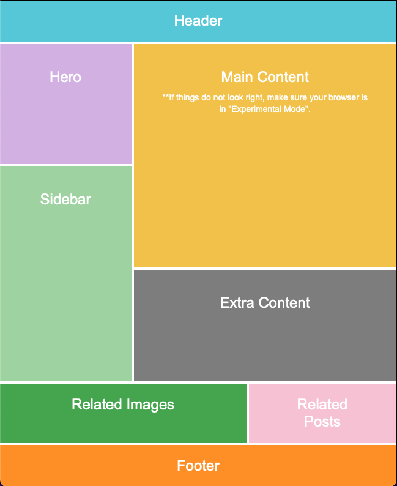

# Challenge 3 - React Flexbox Layout

## 📋 Overview

This challenge demonstrates the creation of a complex flexbox layout using React and CSS. The layout mimics a modern web application interface with multiple sections arranged in a responsive grid pattern.

## 🎯 Objective

Create a pixel-perfect flexbox layout that includes:

- Header spanning full width
- Two-column main content area
- Multi-section layout with different proportions
- Bottom section with related content
- Footer spanning full width

## 🖼️ Layout Structure



_The complete flexbox layout showing all sections with their respective colors and proportions_

## 🛠️ Technologies Used

- **React 18.2.0** - Component library
- **Vite 5.0.8** - Build tool and dev server
- **CSS3 Flexbox** - Layout system
- **CSS Custom Properties** - Design system variables

## 📁 Project Structure

```
Challenge-3/
├── src/
│   ├── components/
│   │   └── Challenge-3.jsx     # Main layout component
│   ├── styles/
│   │   └── Challenge-3.css     # Component styles
│   ├── main.jsx                # React entry point
│   └── index.css               # Global styles reset
├── README.md                   # Project overview
├── package.json                # Project configuration
├── vite.config.js              # Vite configuration
├── index.html                  # HTML template
└── .gitignore                  # Git ignore rules
```

## 🎨 Design System

### Color Palette

```css
--color-header: #5dcedc
--color-hero: #d8b8e8
--color-sidebar: #a8d8a8
--color-main: #f4c842
--color-extra: #888
--color-related-images: #4caf50
--color-related-posts: #f8c8d8
--color-footer: #f90
```

### Typography

- **Font Family:** Arial, sans-serif
- **Large Text:** 24px (headings)
- **Small Text:** 14px (descriptions)
- **Line Height:** 1.4

## 🔧 Key Features

### Flexbox Implementation

- **Container:** `height: 100vh` for exact viewport fit
- **Flex Direction:** Column for main layout
- **Nested Flex:** Multiple levels of flex containers
- **Flex Ratios:** Strategic use of `flex: 1` and `flex: 2`

### CSS Optimization

- **CSS Variables** for consistent theming
- **Grouped Selectors** to reduce redundancy
- **Logical Property Organization**
- **Performance-optimized** color values

## 🚀 Getting Started

### Prerequisites

- Node.js (v16 or higher)
- npm or yarn package manager

### Installation

1. **Clone or download** the project files
2. **Install dependencies:**

   ```bash
   npm install
   ```

3. **Start development server:**

   ```bash
   npm run dev
   ```

4. **Open browser** and navigate to:
   ```
   http://localhost:5173/
   ```

### Available Scripts

- `npm run dev` - Start development server with hot reload
- `npm run build` - Build for production
- `npm run preview` - Preview production build
